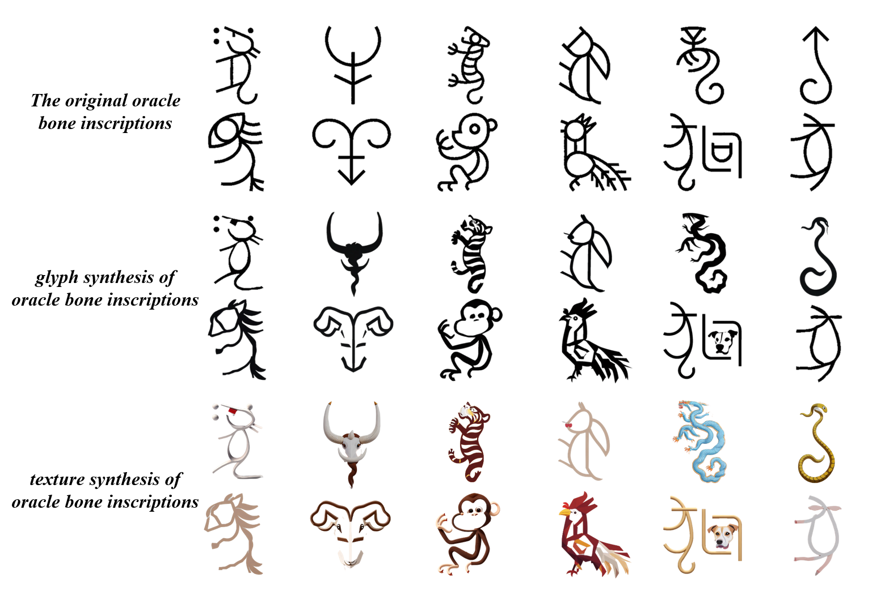

## 1.甲骨文创意文字pipeline

1. 文字字形设计：甲骨文作为象形文字，结构复杂，笔画繁多且单个字符具备完整的含义，若以整个字符进行形变，会导致变形后的字符不可识别，因此以**字符的局部作为形变的对象**。
1. 利用扩散模型（SD）和DDIM反演进行区间分数匹配，使文字轮廓与prompt提示语义相匹配。

## 2.初步测试结果

### 2.1 数据集

实验以清华大学陈楠教授和汉仪字库共同开发完成的汉仪陈体甲骨文[^1]为例。

[^1]:[汉仪陈体甲骨文-汉仪字库 (hanyi.com.cn)](https://www.hanyi.com.cn/productdetail.php?id=2638)

### 2.2 生肖甲骨文创意文字

图中第1、2行为甲骨文字，第2、3行为字形变化后的文字，第4、5行为增加纹理后的文字。

### 2.3 对比实验

[^2]:[[2112.10752\] High-Resolution Image Synthesis with Latent Diffusion Models (arxiv.org)](https://arxiv.org/abs/2112.10752)
[^3]:[[2302.05543\] Adding Conditional Control to Text-to-Image Diffusion Models (arxiv.org)](https://arxiv.org/abs/2302.05543)
[^4]:[[2303.01818\] Word-As-Image for Semantic Typography (arxiv.org)](https://arxiv.org/abs/2303.01818)
[^5]:[GitHub - songyiren98/CLIPFont: Implementation of paper: CLIPFont: Texture Guided Vector WordArt Generation](https://github.com/songyiren98/CLIPFont)
